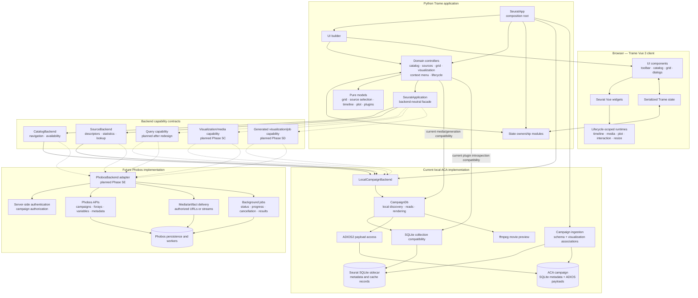

# Seurat Architecture

This diagram shows the current local application path and the planned Phobos
capability path. Solid arrows represent implemented relationships. Dashed
arrows and nodes labeled "planned" represent future work.

## Ownership Rules

- The browser owns interaction mechanics and rendering lifecycles, but not
  campaign data access or backend credentials.
- Trame controllers translate user actions and state changes into application
  operations. They should not depend on SQLite rows, ACA paths, Phobos REST
  objects, or transport-specific query syntax.
- Pure models contain testable workspace, timeline, plot, and source-selection
  policy without Trame dependencies.
- `SeuratApplication` is the facade through which controllers consume backend
  capabilities.
- Backend contracts return normalized Seurat DTOs. Local and Phobos adapters
  implement the same application meaning using different storage and transport.
- The local adapter may use ACA, ADIOS2, SQLite, and ffmpeg internally. Those
  details must not become requirements for the Phobos protocol.
- Phobos should own remote authorization, durable catalog data, media delivery,
  background execution, and artifact persistence.
- Tokens remain on the Python server and must never be serialized into Trame
  state or browser-visible media attributes.

## Current And Planned Capability Boundary

| Capability | Current implementation | Planned direction |
| --- | --- | --- |
| Catalog | Backend-neutral navigation and status | Implement against Phobos campaigns, forays, and variables. |
| Sources | Backend-neutral descriptors, statistics, lookup, and compatibility restriction resolution | Preserve stable source identity and remove the legacy query document after redesign. |
| Query | Python-like parser plus local filter documents | Redesign semantics first, then add a versioned backend-neutral query capability. |
| Stored visualization/media | Controllers still call local data/rendering paths | Add descriptors, explicit timeline metadata, and authorized media transport in Phase 5C. |
| Generated visualization/plugins | Local synchronous generation and plugin paths | Add job, progress, cancellation, error, and result contracts in Phase 5D. |
| Phobos | Design and gap analysis only | Add authenticated adapter after capability contracts are stable. |

The query redesign is intentionally a checkpoint before the planned Query
capability. See [QUERY_REDESIGN.md](QUERY_REDESIGN.md) for the decisions that
must be made before Phase 5B.2 resumes.
