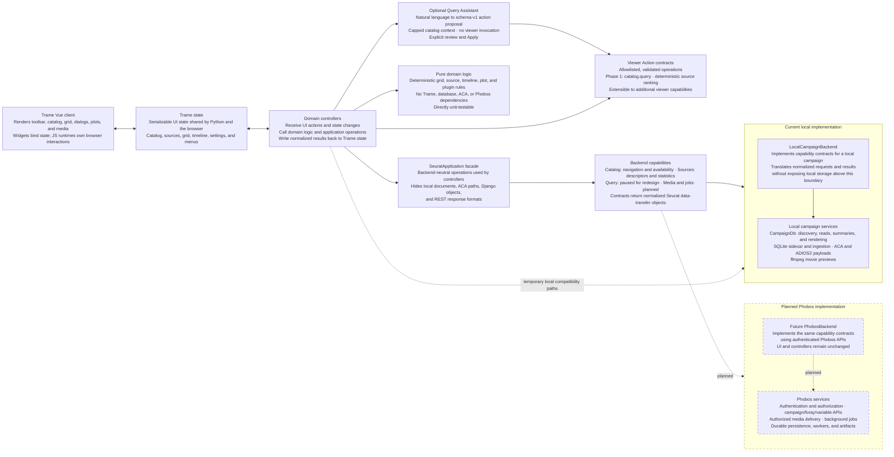

# Seurat Architecture

This diagram shows the current local application path and the planned Phobos
capability path. Solid arrows represent implemented relationships. Dashed
arrows and nodes labeled "planned" represent future work.

```mermaid
%%{init: {"flowchart": {"nodeSpacing": 65, "rankSpacing": 70, "curve": "basis", "wrappingWidth": 290}, "themeVariables": {"fontSize": "14px"}}}%%
flowchart LR
  Client["Trame Vue client<br/>Renders toolbar, catalog, grid, dialogs, plots, and media<br/>Widgets bind state; JS runtimes own browser interactions"]
  State["Trame state<br/>Serializable UI state shared by Python and the browser<br/>Catalog, sources, grid, timeline, settings, and menus"]
  Controllers["Domain controllers<br/>Receive UI actions and state changes<br/>Call domain logic and application operations<br/>Write normalized results back to Trame state"]
  QueryAssistant["Optional Query Assistant<br/>Natural language to schema-v1 action proposal<br/>Capped catalog context · no viewer invocation<br/>Explicit review and Apply"]
  ViewerActions["Viewer Action contracts<br/>Allowlisted, validated operations<br/>Phase 1: catalog.query · deterministic source ranking<br/>Extensible to additional viewer capabilities"]
  Models["Pure domain logic<br/>Deterministic grid, source, timeline, plot, and plugin rules<br/>No Trame, database, ACA, or Phobos dependencies<br/>Directly unit-testable"]
  Facade["SeuratApplication facade<br/>Backend-neutral operations used by controllers<br/>Hides local documents, ACA paths, Django objects,<br/>and REST response formats"]
  Capabilities["Backend capabilities<br/>Catalog: navigation and availability · Sources: descriptors and statistics<br/>Query: paused for redesign · Media and jobs: planned<br/>Contracts return normalized Seurat data-transfer objects"]

  subgraph LOCAL_BRANCH["Current local implementation"]
    direction TB
    LocalBackend["LocalCampaignBackend<br/>Implements capability contracts for a local campaign<br/>Translates normalized requests and results<br/>without exposing local storage above this boundary"]
    LocalServices["Local campaign services<br/>CampaignDb: discovery, reads, summaries, and rendering<br/>SQLite sidecar and ingestion · ACA and ADIOS2 payloads<br/>ffmpeg movie previews"]
    LocalBackend --> LocalServices
  end

  subgraph PHOBOS_BRANCH["Planned Phobos implementation"]
    direction TB
    PhobosBackend["Future PhobosBackend<br/>Implements the same capability contracts<br/>using authenticated Phobos APIs<br/>UI and controllers remain unchanged"]
    PhobosServices["Phobos services<br/>Authentication and authorization · campaign/foray/variable APIs<br/>Authorized media delivery · background jobs<br/>Durable persistence, workers, and artifacts"]
    PhobosBackend -. planned .-> PhobosServices
  end

  Client <--> State
  State <--> Controllers
  Controllers --> QueryAssistant
  QueryAssistant --> ViewerActions
  Controllers --> ViewerActions
  Controllers --> Models
  Controllers --> Facade
  Facade --> Capabilities
  Capabilities --> LOCAL_BRANCH
  Capabilities -. planned .-> PHOBOS_BRANCH
  Controllers -. "temporary local compatibility paths" .-> LOCAL_BRANCH

  classDef planned stroke-dasharray: 6 5
  class PhobosBackend,PhobosServices planned
  style PHOBOS_BRANCH stroke-dasharray: 6 5
```

## Ownership Rules

- The browser owns interaction mechanics and rendering lifecycles, but not
  campaign data access or backend credentials.
- Trame controllers translate user actions and state changes into application
  operations. They should not depend on SQLite rows, ACA paths, Phobos REST
  objects, or transport-specific query syntax.
- Pure domain logic contains testable workspace, timeline, plot, and
  source-selection policy without Trame dependencies.
- `SeuratApplication` is the facade through which controllers consume backend
  capabilities.
- Backend contracts return normalized Seurat DTOs. Local and Phobos adapters
  implement the same application meaning using different storage and transport.
- The local adapter may use ACA, ADIOS2, SQLite, and ffmpeg internally. Those
  details must not become requirements for the Phobos protocol.
- Phobos should own remote authorization, durable catalog data, media delivery,
  background execution, and artifact persistence.
- Tokens remain on the Python server and must never be serialized into Trame
  state or browser-visible media attributes.
- The Query Assistant is a proposal adapter, not an autonomous control path. It
  can see only the user's request and bounded catalog metadata, and it emits a
  schema-v1 Viewer Action envelope. Phase 1 accepts one validated
  `catalog.query` action.
- Source ranking is deterministic application logic. The model identifies the
  variable, statistic, and ordering; Seurat reads local per-source metadata and
  resolves the winning value. Numeric source statistics are not sent to the
  provider.
- The resolved action must pass the existing parser and backend preview before
  the user can apply it. The generated Python-like query is a temporary local
  compatibility representation, not model-authored code.
- An assistant request carries an explicit UI target. The catalog target updates
  the global query; the source-filter target previews and filters only the open
  Sources dialog for its selected variable. Both produce a validated
  `catalog.query` proposal and retain explicit review and Apply steps.
- The Viewer Action contract is the extension point for future non-query
  interface operations. New action types require explicit schemas, validation,
  preview semantics, and authorization; Phase 1 does not expose them.

## Current And Planned Capability Boundary

| Capability | Current implementation | Planned direction |
| --- | --- | --- |
| Catalog | Backend-neutral navigation and status | Implement against Phobos campaigns, forays, and variables. |
| Sources | Backend-neutral descriptors, statistics, lookup, and compatibility restriction resolution | Preserve stable source identity and remove the legacy query document after redesign. |
| Query | Schema-v1 `catalog.query` Viewer Actions with deterministic local source ranking; actions currently compile to Python-like local filter documents after validation | Move execution behind a backend-neutral query capability while retaining the Viewer Action contract and explicit review/apply flow. |
| Stored visualization/media | Controllers still call local data/rendering paths | Add descriptors, explicit timeline metadata, and authorized media transport in Phase 5C. |
| Generated visualization/plugins | Local synchronous generation and plugin paths | Add job, progress, cancellation, error, and result contracts in Phase 5D. |
| Phobos | Design and gap analysis only | Add authenticated adapter after capability contracts are stable. |

The query redesign is intentionally a checkpoint before the planned Query
capability. See [QUERY_REDESIGN.md](QUERY_REDESIGN.md) for the decisions that
must be made before Phase 5B.2 resumes.
