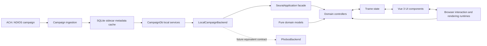

# Seurat: Product, Design, and Implementation Overview

Status: current as of August 2026 on the `freeform_drag_and_drop` branch.

## Executive summary

Seurat is an interactive scientific campaign viewer for ADIOS Campaign Archive
(`.aca`) files. It helps scientists explore a campaign's variables, runs,
sources, statistics, stored visualizations, generated plots, image sequences,
and analysis products without requiring them to understand the archive's
physical storage layout.

The application is built with Python, Trame, and Vue 3. Python owns campaign
access, semantic state, validation, and application policy. The browser owns
low-latency interaction mechanics and rendering lifecycles. A local SQLite
sidecar provides an indexed, metadata-oriented view of the ACA archive, while
large data and image bytes remain in the campaign until needed.

The primary user experience is a variable catalog beside a multi-tab,
multi-pane visualization workspace. Freeform is the default layout: plots can
be positioned and resized on a grid-snapped canvas while retaining predictable
alignment and portable, serializable geometry. Uniform and Spanning layouts
remain available for structured dashboards.

There are no known blockers remaining from the current Freeform default,
workspace-wide new-plot sizing, or responsive 1D plot work. The broader product
and architectural opportunities are listed at the end of this document.

## Purpose

Seurat is intended to make large HPC campaign archives understandable and
interactive. Its main jobs are to:

- discover variables across many files, datasets, runs, and producers;
- group source-independent variables while retaining source-specific identity;
- filter the catalog and source list using metadata and summary statistics;
- compare the same quantity across sources or runs;
- display stored images, image sequences, movies, scalar fields, and 1D plots;
- synchronize time-aware visualizations through one shared timeline;
- arrange visualizations into durable workspaces with tabs and split panes;
- execute compatible local analysis plugins and generated-plot workflows;
- save semantic viewer state without embedding large media payloads; and
- provide a backend-neutral path toward a future Phobos-hosted deployment.

The current application is a local campaign viewer. It is not a simulation
authoring tool, a general-purpose data editor, or a replacement for ADIOS,
Fides, or `hpc_campaign`. It consumes the storage and semantic information
provided by those systems and turns it into an exploratory visual workspace.

## Intended users and workflows

The primary users are scientists and scientific-software developers working
with multi-run simulation or analysis campaigns. Common workflows include:

1. Open a campaign and inspect the available variable or file hierarchy.
2. Search or query for a quantity, code output, run, or source.
3. Review source-level minimum and maximum statistics.
4. Drag variables onto a workspace and compare visualizations.
5. Scrub or play the campaign timeline across related tiles.
6. Split the workspace or create tabs to organize different questions.
7. Adjust visualization settings or run a compatible analysis plugin.
8. Save the workspace and restore it later against the same campaign.

## Product design principles

### Scientific identity before file layout

`variable_id` is treated as a source-independent scientific identity.
`source_dataset` and the normalized source descriptor distinguish individual
representations, runs, or producing datasets. This lets the UI group equivalent
variables without losing the source context needed for comparison.

### Direct manipulation with predictable results

Dragging, resizing, tab movement, pane splitting, plot navigation, and timeline
control happen directly in the browser. Potentially destructive Freeform
reflows use an outline or insertion caret before commit. The final semantic
change is sent to Python only after the interaction is complete.

### Semantic state, derived rendering

Workspace files store selections, variable/source assignments, visualization
settings, pane structure, and grid-unit geometry. Rendered SVG, image bytes,
movie frames, and other derived payloads are not stored in the workspace.

### Testable policy at clear boundaries

Geometry, timeline, plot-setting, source-selection, and workspace rules live in
pure Python models where possible. Controllers adapt these rules to Trame
state. Browser code owns only interaction and rendering behavior that requires
the DOM.

### Local today, backend-neutral tomorrow

The application facade and backend contracts hide local SQLite and ACA details
from migrated controller paths. A future Phobos adapter is intended to provide
the same normalized meaning through authenticated remote services.

## User-interface design

### Application shell

The top toolbar contains the campaign name, Advanced Query input, optional
natural-language Ask and Visualize actions, and shared viewer controls. The
hamburger drawer provides workspace Save, Save As, and Load operations.

The main area has two primary regions:

- **Variable panel:** searchable variables or files, grouping controls, a
  visualized-only filter, and a resizable divider.
- **Visualization workspace:** timeline controls, layout settings, tabs, pane
  split controls, visualization tiles, and the selected-variable details area.

Dialogs and floating panels handle sources, scalar-field settings, plot
settings, plugin options, help, and assistant proposal review.

### Workspace, panes, and tabs

The workspace is represented by a bounded binary split tree. Its leaves are
panes, each pane owns one or more tabs, and each tab owns a complete grid
snapshot. Any pane can be split right or down, up to four panes. Split ratios
are proportional so they survive window-size changes.

Tabs can be created, renamed, closed, reordered, and moved between panes. A tab
owns its layout mode, tile contents, canvas or grid geometry, selection,
timeline-driver cell, sizing options, and visualization settings. Campaign
selection, query state, catalog state, current timestep, and the default size
for newly dropped plots are shared across the workspace.

### Layout modes

Seurat supports three layout modes:

- **Freeform:** the default. Tiles use portable `{x, y, w, h}` canvas units and
  can be placed independently.
- **Uniform:** a conventional row-by-column grid with shared track sizing.
- **Spanning:** a structured grid in which tiles may span multiple rows or
  columns.

New tabs and panes start empty in Freeform mode. Explicitly saved modes remain
part of their tab-owned state.

### Freeform canvas

The default canvas has 24 horizontal columns and a 24-pixel vertical unit.
Users may choose 12, 24, 36, or 48 columns. Vertical space grows as needed.
Tile geometry is persisted in canvas units, not pixels, so layouts remain
aligned when the viewport changes.

Freeform behavior includes:

- grid snapping with sticky hysteresis, enabled by default;
- optional collision nudging, enabled by default;
- a visible-grid toggle;
- zoom in, zoom out, and Fit controls;
- a workspace-wide new-plot width from 2 through 12 columns;
- square initial plot drops based on the actual canvas column width;
- header-based movement;
- resize handles on all edges and corners;
- nearest-edge row and column insertion;
- insertion between adjacent tiles with space-making reflow;
- gap fitting, nearest-free placement, and vertical collision pushing;
- live placeholders, insertion carets, alignment guides, and dwell previews;
  and
- final server-side geometry validation before state is accepted.

The browser takes a complete layout snapshot at the start of a pointer
interaction. It computes reversible previews locally and commits one grid-unit
layout when the interaction ends. The pure Python and JavaScript geometry
implementations mirror the same placement rules.

### Plots and media

1D plots are rendered as responsive SVG in the browser. The plot runtime owns
axis resolution, ticks, paths, cursor drawing, hover inspection, pan, zoom,
reset, and ResizeObserver-driven redraw. Small tiles use adaptive padding,
label visibility, font size, and tick count rather than scaling a fixed-size
image.

Image and video tiles use a separate media runtime for pan, zoom, reset, frame
selection, and lifecycle cleanup. Scalar-field tiles support color maps,
contours, axes, color bars, ranges, and source-aware rendering settings.

### Timeline

A shared VCR bar provides start, back, play, pause, forward, and end actions.
One tile may act as the timeline driver. The timeline runtime distinguishes
schema-less timestep indices from declared physical-time values and keeps
plots, images, and videos synchronized without placing playback mechanics in
Python callbacks.

### Query and assistant surfaces

Advanced Query accepts the current Python-like compatibility syntax. Query
rearchitecture is paused pending product decisions about concepts, scopes,
fields, and the desired combination of text query, structured filters, and
natural language.

The optional Viewer Assistant translates natural language into a versioned,
allowlisted Viewer Action proposal. Current actions are `catalog.query` and
`visualization.add`. Proposals are validated and previewed before explicit user
application. Provider credentials remain in Python, catalog context is bounded,
and array values or media payloads are not sent to the model.

## Data and persistence model

### Campaign ingestion and sidecar

On startup, Seurat reads the `.aca` archive and ingests searchable campaign
metadata into a local SQLite sidecar. `CampaignDb` supplies the current local
query, source, summary, visualization, and rendering services. Image sequence
bytes are loaded lazily from ACA variables; the sidecar stores frame metadata
and variable paths rather than copied image blobs.

The current startup path drops and re-ingests the sidecar every time. The
sidecar should therefore be treated as a rebuildable viewer cache, not durable
user data.

### Semantic metadata

Seurat consumes:

- ADIOS variable names, shapes, steps, attributes, and values;
- `hpc_campaign` dataset identity, hierarchy, replicas, and visualization
  associations;
- the embedded `__campaign_schema.yaml` document or its legacy/fallback forms;
- optional axes, meshes, bases, variable groups, and visualization templates;
- optional external image-association schemas for older campaigns; and
- plugin-specific source or variable context.

Direct `hpc_campaign` visualization associations are preferred. Legacy path
parsing remains a fallback for older archives.

### Workspace files

Workspace JSON currently uses format `seurat-workspace`, version 2. It stores:

- campaign identity;
- catalog view, query, and variable grouping state;
- the pane split tree and proportional split ratios;
- pane tabs and their grid snapshots;
- variable and source assignments;
- visualization, plot, scalar-field, and plugin settings;
- selected cells and timeline driver;
- Freeform geometry, canvas settings, zoom, and fit state; and
- the workspace-wide default width for newly dropped plots.

Workspace documents exclude rendered plots, source image bytes, movie frames,
provider credentials, and other derived or sensitive runtime data. Loading a
workspace validates its format and campaign, then rebuilds derived tile content
from the campaign.

## Implementation architecture



### Composition root

`seurat.app.SeuratApp` enables the web module, opens the SQLite collection,
constructs `CampaignDb` and `LocalCampaignBackend`, initializes Trame state,
attaches controllers, creates the optional query translator and interaction
log, and builds the UI.

Top-level modules such as `app.py`, `ui.py`, `controllers.py`, and
`state_init.py` remain compatibility entry points. `seurat/` is the active
packaged implementation.

### Implementation map

| Area | Main paths | Responsibility |
| --- | --- | --- |
| Composition | `seurat/app.py` | Connect server, data access, controllers, state, and UI. |
| UI | `seurat/components/` | Declarative Trame/Vuetify application sections and bindings. |
| State | `seurat/state/` | Explicit defaults and ownership by domain. |
| Controllers | `seurat/controllers/` | Trame actions, triggers, state callbacks, validation, and orchestration. |
| Models | `seurat/models/` | Pure grid, canvas, workspace, plot, timeline, and source-selection rules. |
| Backend contracts | `seurat/backends/contracts.py` | Normalized catalog and source capability DTOs. |
| Local backend | `seurat/backends/local.py` | Adapt `CampaignDb` to backend-neutral contracts. |
| Campaign services | `ingest_campaign.py`, `db.py`, `sqlite_store.py` | ACA ingestion, metadata queries, source lookup, and local rendering. |
| Browser runtimes | `seurat/module/serve/*.js` | Canvas, interaction, resize, plot, media, timeline, and lifecycle behavior. |
| Styling | `seurat/module/serve/seurat.css` | Application, workspace, tile, control, and visualization styling. |
| Plugins | `plugin_runtime.py`, `seurat_plugins/` | Plugin discovery, compatibility checks, options, and rendering. |
| Assistant | `seurat/query_assistant.py`, `seurat/viewer_actions.py` | Provider translation and validated action contracts. |
| Learning log | `seurat/learning/` | Optional privacy-bounded interaction event logging and audit. |
| Tests | `tests/`, `tests/browser/` | Pure unit tests and mounted Chromium behavior tests. |

### Controller organization

`SeuratController` composes domain mixins for catalog, query assistant,
sources, grid, visualization, context menu, workspace, and lifecycle behavior.
Each domain declares the actions, triggers, and state-change callbacks it owns.
Controllers should bind state to application operations, not embed storage or
DOM policy.

### State ownership

State defaults are split into catalog, query assistant, sources,
visualization, grid, context-menu, and workspace sections. A tab snapshot copies
only tab-owned grid state. Shared state—such as the active campaign, query,
timeline position, and new-plot default—is deliberately outside tab snapshots.

### Browser runtimes

The web module registers focused lifecycle owners:

- `seurat-canvas-runtime.js`: Freeform pointer interactions and canvas view;
- `seurat-interaction-runtime.js`: variable/grid/tab drag-and-drop, pane
  dividers, context menus, and floating panels;
- `seurat-resize-runtime.js`: variable-panel and structured-grid resizing;
- `seurat-plot-runtime.js`: responsive SVG plots and plot interaction;
- `seurat-media-runtime.js`: image/video pan, zoom, and reset;
- `seurat-timeline-runtime.js`: VCR policy and synchronized playback;
- `seurat-grid-runtime.js`: Vue lifecycle registration; and
- `seurat.js`: coordination between plot, media, timeline, and reset behavior.

Each runtime owns and releases its event listeners, observers, timers, pointer
capture, and temporary classes. Client runtimes may derive pixels but commit
semantic values, such as grid geometry or proportional split ratios.

## Extension model

Seurat supports built-in Python plugins and personal plugin files in
`~/.seurat/plugins` or `SEURAT_PLUGIN_PATH`. Variable plugins advertise support
for variable metadata and appear as visualization choices. Source plugins
advertise support for a source context and appear in a tile's Run Plugin menu.

Plugins provide a stable ID, label, optional scope, options schema, support
predicate, and render function. Returned content is normalized into a Seurat
tile. Plugin dependencies and execution currently live in the local Python
process; remote execution, progress, cancellation, and durable results belong
in the planned generated-visualization/job capability.

## Privacy and security boundaries

- Campaign and provider credentials stay in the Python process.
- Browser-visible state contains viewer data, not secret tokens.
- Assistant requests receive bounded catalog metadata, not array or media data.
- Viewer Actions are allowlisted, parsed, validated, previewed, and explicitly
  applied.
- Interaction logging is disabled by default and omits paths, raw prompt/query
  text, media, arrays, and tab titles.
- Workspace JSON contains semantic state but not rendered media or credentials.
- A future remote backend must preserve authorization and use protected or
  signed media delivery rather than exposing backend tokens.

## Operational requirements

The local application requires Python 3.10 or newer, Trame, Trame Vuetify,
ADIOS2, NumPy, Pillow, and ContourPy. YAML schemas require PyYAML. Movie previews
require `ffmpeg` on `PATH`.

Typical setup and launch:

```bash
python -m pip install -e ".[schema]"
python app.py /path/to/campaign.aca
```

Useful verification:

```bash
python -m py_compile app.py ingest_campaign.py db.py controllers.py ui.py
python -m pytest -q
python -m pip check

SEURAT_RUN_BROWSER_TESTS=1 python -m pytest -q tests/browser
```

At the time this document was written, the current branch passed 218 Python
tests plus 7 subtests and 54 mounted Chromium tests.

## Current constraints and known limitations

- The SQLite sidecar is dropped and re-ingested on every startup.
- Large catalogs are delivered through a primarily eager navigation model;
  pagination and list virtualization are not yet the main interaction path.
- Expensive movie, scalar-field, generated-plot, and plugin work does not yet
  share a complete background job/progress/cancellation contract.
- Query and Source Filter expose related concepts through compatibility syntax
  and do not yet share one typed, backend-neutral filter tree.
- Some query fields are accepted where the corresponding source record cannot
  supply them, and legacy source identity can still be ambiguous in edge cases.
- Freeform placement has known dense-layout limitations: whitespace pockets,
  no general compaction pass, partial seam-straddling behavior, and limited
  gap-aware horizontal resize policy.
- Layout editing does not yet provide a user-facing undo/redo history or
  automatic crash/session recovery.
- Built-in plugin discovery eagerly imports plugin modules; an unavailable
  optional dependency can interfere with discovery instead of producing one
  isolated “plugin unavailable” result.
- Stored and generated visualization/media operations are not fully behind the
  backend capability boundary yet.
- The Phobos adapter, authenticated media path, remote jobs, and multi-user
  deployment model remain planned work.

## Recommendations

### Five high-priority improvements to make Seurat function better

1. **Make startup incremental and cache-aware.** Store a campaign fingerprint,
   schema version, and ingest version in the SQLite sidecar. Reuse the sidecar
   when the ACA file is unchanged, selectively invalidate affected records,
   expose rebuild status, and provide a deliberate “Rebuild cache” action. This
   will make repeated use of large campaigns dramatically faster and safer.

2. **Scale catalog and source browsing for very large campaigns.** Add
   backend-level pagination, incremental tree expansion, server-side sorting,
   result counts, and virtualized variable/source lists. Preserve stable
   selection while results stream in, and cache frequent query summaries. This
   should be measured against representative multi-run campaigns rather than
   only fixture-sized data.

3. **Introduce a shared asynchronous job contract.** Move movie generation,
   scalar-field rendering, generated scalar plots, and plugin execution behind
   typed jobs with progress, cancellation, idempotency keys, retryable errors,
   expiration, and cached results. Keep the UI responsive and make pending or
   failed work visible and recoverable.

4. **Make Freeform editing recoverable and invariant-driven.** Add undo/redo,
   autosaved session recovery, keyboard movement/resizing, a compaction command,
   and property-based tests for dense layouts. Finish seam-straddling,
   gap-aware resize, and horizontal packing rules so every operation guarantees
   stable IDs, no overlap, in-bounds geometry, and predictable neighbor motion.

5. **Stabilize query, source, media, and extension boundaries.** Complete the
   typed query/source redesign, use compound stable source identity everywhere,
   move remaining media operations behind backend contracts, and make plugin
   discovery dependency-aware and failure-isolated. These changes reduce local
   storage leakage, prevent incorrect source matches, and prepare the same UI
   for a Phobos backend.

### Five high-priority improvements to make Seurat look better

1. **Redesign the application shell and hierarchy.** Reduce the height and
   visual weight of the top toolbar, group campaign/query/view actions by task,
   and give the canvas more uninterrupted space. Use a compact secondary bar
   for timeline and canvas controls instead of treating every action equally.

2. **Create a coherent visual design system.** Define CSS tokens for color,
   typography, spacing, radius, elevation, focus rings, control heights, and
   semantic states. Replace the remaining mixture of raw borders, grays,
   Vuetify defaults, and one-off inline styles with a small, documented system.

3. **Refine tile chrome and selection.** Use quieter headers, consistent title
   typography, subtle elevation, and one selection language across active,
   multi-selected, timeline-driver, loading, and error states. Reveal secondary
   actions on hover/focus and preserve content area in small tiles.

4. **Upgrade plot and scientific-visual styling.** Use a deliberate accessible
   palette, improved axis typography, consistent grid lines, compact legends,
   clearer hover readouts, and source-comparison styling. Make plots look
   authored at every tile size rather than merely fitted into a rectangle.

5. **Improve responsive states and visual feedback.** Add polished empty
   states, loading skeletons, progress treatments, inline errors, drop targets,
   and success feedback. Make the catalog, details panel, settings popovers,
   tab strips, and split panes adapt gracefully from laptop to large-display
   layouts.

### Other, lesser-priority improvements

- Add note and annotation tiles with Markdown, links, and optional variable or
  source references.
- Provide reusable workspace templates for common comparison layouts.
- Add named bookmarks or snapshots within one workspace file.
- Export a pane, tab, or selected tiles to PNG, SVG, PDF, or a report bundle.
- Add a command palette and discoverable keyboard-shortcut reference.
- Offer linked-axis, linked-zoom, and linked-cursor groups for plot comparison.
- Add a dark theme and a high-contrast scientific-presentation theme.
- Perform a full accessibility pass for keyboard flow, screen-reader names,
  contrast, reduced motion, and focus restoration after dialogs or drag actions.
- Add optional unit display, formatting rules, and scientifically meaningful
  significant-digit controls.
- Provide a plugin manager that reports availability, missing dependencies,
  versions, options, execution history, and failures.
- Add an explicit provenance inspector showing how each tile was sourced or
  generated and which query, plugin, or schema association selected it.
- Support copy/paste and duplicate for tiles, tabs, and pane layouts.
- Add touch and pen interaction only after desktop pointer and keyboard behavior
  is fully specified and tested.
- Add optional layout suggestions, such as align, distribute, pack, or arrange
  selected tiles by variable, source, or visualization type.
- Expand the assistant only through new typed Viewer Actions with preview and
  confirmation; useful candidates include workspace organization and safe
  visualization-setting changes.
- Add automated screenshot regression tests for the major layouts, themes,
  dialogs, and compact tile sizes.
- Continue the Phobos adapter work after catalog, source, query, media, and job
  contracts have stable local implementations and shared contract tests.
